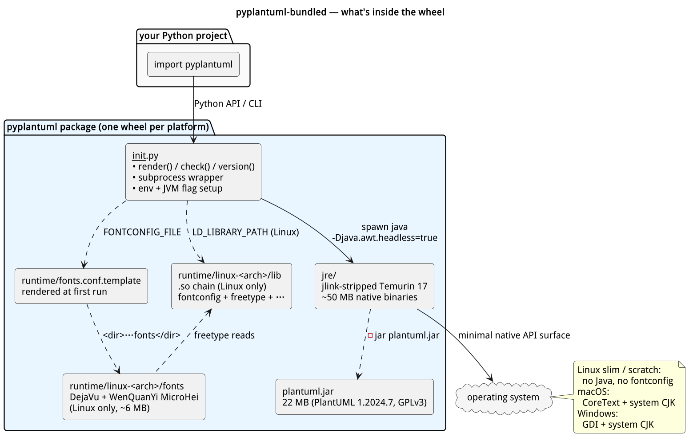
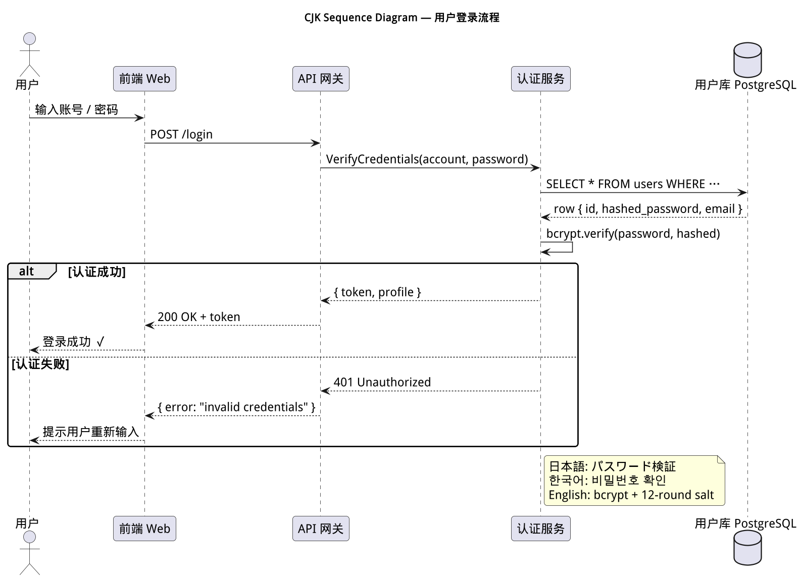
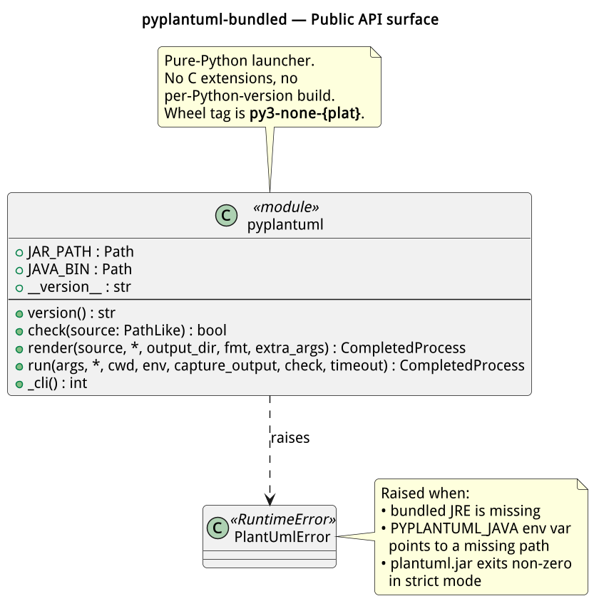
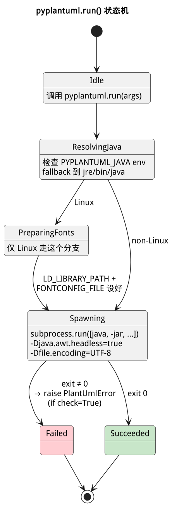

# pyplantuml-bundled

[](https://github.com/HansBug/pyplantuml-bundled/actions/workflows/build.yml)
[](LICENSE)
[]()
[](https://github.com/plantuml/plantuml)

`pip install pyplantuml-bundled` and you have a working PlantUML — no system Java, no `apt install fontconfig`, no extra fonts. Even on a `python:3.10-slim` or `alpine` container that ships nothing but the Python interpreter, this package renders PlantUML diagrams (including CJK text) out of the box.


## Why this exists

PlantUML is ubiquitous in CI doc-builds, lint hooks, notebook sidecars, and code-review tooling. The standard `plantuml` PyPI package is a thin Python wrapper that shells out to a `java` you have to install yourself. That works on a developer laptop but adds friction to every container, every cloud function, every "just pip install everything" pipeline. This package trades wheel size (≈50–60 MB per platform) for `pip install` ergonomics: one line of dependency, zero system prerequisites, deterministic rendering across Linux glibc, Linux musl, macOS, and Windows.

## What's in the wheel



| Component | Source | Per-platform size | License |
|---|---|---|---|
| `plantuml.jar` | upstream PlantUML 1.2024.7 | 22 MB (shared) | GPL-3.0-or-later |
| `jre/` | Eclipse Temurin 17 (Microsoft OpenJDK 17 on Win-ARM64), `jlink`-stripped to the modules PlantUML actually uses | 47–58 MB | GPLv2 + Classpath Exception |
| `runtime/linux-<arch>/lib` | `libfontconfig.so.1` + `libfreetype.so.6` + chain | 1.8 MB (Linux only) | MIT / FTL / various permissive |
| `runtime/linux-<arch>/fonts` | DejaVu Sans + WenQuanYi Micro Hei | 6.4 MB (Linux only) | Bitstream Vera / Apache-2.0 |
| `runtime/fonts.conf.template` | rendered with absolute paths at first run | <1 KB | n/a |
| `__init__.py` | pure-Python launcher / API | 4 KB | GPL-3.0-or-later |

The JRE module set is the empirically minimal set that still renders PNG, SVG, ASCII, and runs `-checkonly`: `java.base, java.desktop, java.xml, java.scripting, java.naming, java.logging, java.management, java.sql, jdk.zipfs, jdk.crypto.ec, jdk.unsupported`.

## Install

```bash
pip install pyplantuml-bundled
```

`pip` selects the right wheel for your OS, architecture, and libc automatically. **One single wheel covers Python 3.7 through 3.14** on the same platform — there are no per-Python-version wheels because the package has no C extensions and the launcher uses only pre-3.7 stdlib APIs. Wheel tag is `py3-none-{platform}`.

Supported pre-built wheels:

| OS / libc | x86_64 | aarch64 / arm64 | Approx. wheel size |
|---|---|---|---|
| Linux glibc (`manylinux_2_28`)   | ✅ | ✅ | ~58 MB |
| Linux musl (`musllinux_1_2`)     | ✅ | ✅ | ~55 MB |
| macOS                            | ✅ (Intel) | ✅ (Apple Silicon) | ~50 MB |
| Windows                          | ✅ | ✅ | ~48 MB |

## Quick start

### CLI

The `plantuml` console script proxies all arguments straight to the bundled `plantuml.jar`:

```bash
plantuml -tpng diagram.puml          # render to PNG
plantuml -tsvg diagram.puml          # render to SVG
plantuml -checkonly diagram.puml     # static check; exit 0 if valid
plantuml -version                    # PlantUML + JRE versions
plantuml -help                       # full upstream CLI options
```

### Python API

```python
from pyplantuml import render, check, version, run, JAR_PATH, JAVA_BIN, PlantUmlError

# Render to a target directory:
render("diagram.puml", fmt="svg", output_dir="out/")

# Static check; True iff the file is syntactically valid:
assert check("diagram.puml")

# Multi-line version string from PlantUML + bundled JRE:
print(version())

# Pass any plantuml.jar arguments through; full subprocess.CompletedProcess back:
proc = run(["-help"], capture_output=True)
print(proc.stdout)

# Locate the bundled binaries (useful for advanced integrations):
print(JAR_PATH)   # …/site-packages/pyplantuml/plantuml.jar
print(JAVA_BIN)   # …/site-packages/pyplantuml/jre/bin/java
```

`render`, `check`, and `run` raise `PlantUmlError` on failure (subclass of `RuntimeError`). Pass `check=False` to `run` to recover from non-zero exits manually.

## CJK rendering

Tofu-free Chinese / Japanese / Korean rendering is a deliberate feature, not an accident. On Linux the wheel ships its own `libfontconfig` chain plus DejaVu (Latin / Cyrillic / Greek) and WenQuanYi Micro Hei (a single `.ttc` covering Simplified Chinese, Traditional Chinese, Japanese kana + common kanji, Korean Hangul). The launcher writes a tiny `fonts.conf` with `<lang>zh|ja|ko</lang>` rules so PlantUML's text layout picks the right family per script.

The example below was rendered from `examples/01_sequence_cjk.puml` inside a `python:3.10-slim` container with no system fonts:



On macOS and Windows the wheel relies on the OS-provided font stack (CoreText / GDI), which already ships CJK families (PingFang SC, Microsoft YaHei, Yu Gothic, Malgun Gothic). No extra bundling required there.

## More example diagrams

These all live in `examples/` and are re-rendered as part of every release:

| Diagram | Renders | Source |
|---|---|---|
| `class_diagram.png` | API surface as UML | [`02_class_diagram.puml`](examples/02_class_diagram.puml) |
| `state_machine.png` | `pyplantuml.run()` lifecycle | [`04_state_machine.puml`](examples/04_state_machine.puml) |
| `component_pipeline.png` | The CI build matrix | [`03_component_pipeline.puml`](examples/03_component_pipeline.puml) |

<table>
<tr>
<td></td>
<td></td>
</tr>
</table>

## How it works

1. The Python launcher (`pyplantuml/__init__.py`) locates `plantuml.jar` and the bundled `java` via `Path(__file__).parent`.
2. On Linux it materialises a `fonts.conf` into the user cache dir (default: `~/.cache/pyplantuml/fontconfig/`) with absolute paths to the bundled font directory.
3. It builds an env where `LD_LIBRARY_PATH` is prepended with `runtime/linux-<arch>/lib` and `FONTCONFIG_FILE` points at the rendered `fonts.conf`. macOS and Windows skip this step entirely.
4. `subprocess.run(["…/jre/bin/java", "-Djava.awt.headless=true", "-Dfile.encoding=UTF-8", "-jar", JAR_PATH, *args], env=…)` does the actual rendering.

Want to use a different JVM (system Java, GraalVM, etc.) for debugging? Set `PYPLANTUML_JAVA=/path/to/java` and the bundled JRE is bypassed.

## Configuration

| Environment variable | Effect |
|---|---|
| `PYPLANTUML_JAVA` | Override the bundled JRE with an arbitrary `java` executable. |
| `XDG_CACHE_HOME` | Override the location of the rendered `fonts.conf` (Linux only). Defaults to `$HOME/.cache`. |
| `LOCALAPPDATA` | Same as above on Windows. |
| Standard PlantUML env vars (`PLANTUML_LIMIT_SIZE`, `GRAPHVIZ_DOT`, …) | Forwarded to the JVM unchanged. |

## Comparison with related projects

| | `pyplantuml-bundled` (this) | `plantuml` (PyPI) | `plantuml-server` (Docker) |
|---|---|---|---|
| Install | `pip install` | `pip install` + `apt install default-jre` | `docker pull` |
| System Java required | **No** | Yes | (in-container) |
| CJK out of the box | **Yes** (Linux too) | If host has fonts | If host has fonts |
| Wheel size | 50–60 MB | <1 MB | n/a |
| Rendering speed | JVM cold-start each call | Same | HTTP, persistent JVM |
| Best for | CI, scripts, single-shot rendering, sandboxed environments | Dev laptops with Java already installed | Interactive editors, high-throughput servers |

For high-volume rendering keep a JVM warm by reusing one `subprocess.Popen` (PlantUML supports a `-pipe` mode that reads multiple diagrams off stdin) — that's an upstream feature you can use through `pyplantuml.run(["-pipe"], …)`.

## Troubleshooting

**`PlantUmlError: bundled JRE not found at …/jre/bin/java`** — you installed a wheel built for a different platform (e.g. installed `manylinux` wheel on macOS via `--platform`). Reinstall with the right platform tag, or set `PYPLANTUML_JAVA` to a system JVM.

**`Fontconfig warning: … unknown element "reset-dirs"`** — benign. Older bundled `libfontconfig` sees newer system config syntax. Suppress with `2>/dev/null`. Does not affect rendering. To be cleaned up in a future release.

**CJK shows as boxes (tofu) on Linux** — the wheel was *not* built with `runtime/linux-<arch>/` populated (e.g. you built from source and skipped `scripts/stage_linux_runtime.sh`). Run `make assets && pip install --force-reinstall .`.

**Slow first render on Linux** — fontconfig is building its on-disk cache for the bundled fonts. One-time cost, lives at `~/.cache/pyplantuml/fontconfig/`.

**Need GraphViz output (`dot` engine, component / class diagrams with auto-layout)** — install Graphviz separately (`apt install graphviz` / `brew install graphviz`) and PlantUML will pick it up via `$PATH`. Bundling Graphviz is not in scope; it would double the wheel size.

## Building from source

```bash
git clone https://github.com/HansBug/pyplantuml-bundled
cd pyplantuml-bundled

# Requires JDK 17 with the jmods directory (e.g. Eclipse Temurin 17).
export JAVA_HOME=/path/to/jdk17

make assets               # fetch jar, jlink JRE, stage Linux native libs
python -m build --wheel   # emits dist/pyplantuml_bundled-*.whl
pip install pytest dist/*.whl
pytest tests/             # 12 tests: render PNG/SVG, CJK byte-size, etc.
```

For the multi-platform build matrix see [`.github/workflows/build.yml`](.github/workflows/build.yml). It uses [`cibuildwheel`](https://cibuildwheel.pypa.io/) to produce one wheel per `(OS, arch, libc)` triple, with the `JAVA_HOME` and `LD_LIBRARY_PATH` plumbing wired up per matrix entry.

## License

GPL-3.0-or-later, inherited from PlantUML upstream. The full text of every redistributed binary's license lives in [`NOTICE`](NOTICE) and inside the bundled `plantuml.jar` itself under `META-INF/`.

## Versioning

The package version mirrors the bundled PlantUML release with a build suffix: `1.2024.7.post1` means PlantUML 1.2024.7 plus this project's first wheel rebuild. Tag a new commit `vX.Y.Z` to trigger a fresh CI release.
